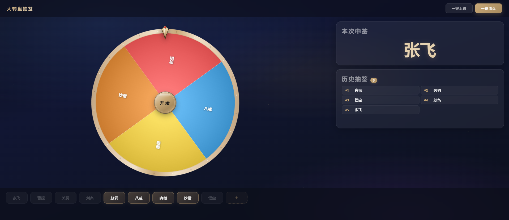

# 大转盘抽签系统 / Lucky Wheel

> **单页 HTML 大转盘抽签工具，零依赖、离线可用、数据本地持久化。适合例会点名、活动抽奖等小团队场景。**
>
> *Single-file HTML lucky wheel & random picker. Zero dependencies, offline-ready, local persistence. Ideal for meetings, roll calls, and small-team giveaways.*

主持人电脑接大屏投影，随机抽取人员参与互动环节。纯前端单页应用，双击即用。

A single-page front-end app for hosts to project on a big screen and randomly pick participants for interactive activities. Double-click to run.

## 效果预览 / Preview

**在线体验 / Live Demo**：https://levi4433.github.io/lucky-wheel/



## 功能特性 / Features

- **人员管理 / Participant Management**：增删改姓名（上限 50 人），重名自动拦截（单击上/下盘、双击编辑）
- **三级状态机 / 3-State Machine**：空闲 → 已上盘 → 已抽中，单击上盘、再次单击下盘
- **抽签动画 / Spin Animation**：Canvas 2D 绘制转盘，3.5 秒缓动旋转，5~8 圈随机停止，中签扇区 1 秒金色高亮动效
- **一键上盘 vs 一键清盘 / One-click Actions**：一键上盘全员重新上盘且历史保留；一键清盘清空转盘与历史开新一轮
- **历史记录 / History**：两列网格倒序展示，关闭浏览器不丢失
- **持久化 / Persistence**：`localStorage` 存储，重启电脑数据仍在
- **响应式 / Responsive**：横屏（左转盘右面板）/ 竖屏（上转盘下面板）自适应
- **零网络依赖 / Zero Network**：纯前端，无 CDN、无后端、无任何外部请求

## 快速开始 / Quick Start

```bash
# 方式 1：直接双击 index.html 用浏览器打开 / Option 1: double-click index.html
# 方式 2：命令行启动 / Option 2: command line
start index.html        # Windows
open index.html         # macOS
xdg-open index.html     # Linux
```

首次打开会自动生成 12 个空白槽位，点击空白按钮输入姓名即可开始。

On first launch, 12 empty slots are auto-generated. Click an empty slot to enter a name and start.

## 使用流程 / Workflow

1. 单击空白按钮 → 输入人员姓名（重名会被拦截）
2. 单击已命名的按钮 → 名字加入转盘（按钮变灰）
3. 再次单击灰色按钮 → 下盘（按钮恢复彩色）
4. 双击任意按钮 → 编辑姓名（编辑后回到未上盘状态，需重新上盘）
5. 点击转盘中心「开始」按钮 → 旋转 3.5 秒后停止，右侧显示中签者
6. 中签者按钮变深灰禁用，历史记录自动追加
7. 顶部「一键上盘」全员重新上盘（历史保留）/「一键清盘」清空转盘与历史开新一轮

1. Single-click an empty slot → enter a name (duplicates are blocked)
2. Single-click a named button → name joins the wheel (button turns grey)
3. Single-click a grey button again → remove from wheel (button turns colored)
4. Double-click any button → edit the name (status resets to idle, re-add to wheel manually)
5. Click the center "Start" button → spins 3.5s, winner shown on the right
6. Winner's button is disabled, history auto-appended
7. Top bar "一键上盘" puts everyone back on the wheel (history kept) / "一键清盘" clears wheel & history for a new round

## 目录结构 / Project Structure

```
lucky-wheel/
├── index.html                          # 单文件应用（HTML + CSS + JS 全部内联）/ Single-file app
├── README.md                           # 项目说明 / Project doc
├── docs/                               # 截图等资料 / Assets
└── LICENSE                             # MIT
```

## 技术栈 / Tech Stack

| 项目 / Item | 选型 / Choice |
|---|---|
| 标记 / Markup | 原生 HTML5 / Native HTML5 |
| 样式 / Style | 原生 CSS3（含 `backdrop-filter` 毛玻璃、CSS 动画）/ Native CSS3 |
| 脚本 / Script | Vanilla JavaScript (ES6) |
| 存储 / Storage | `localStorage`（键名 `wheelData`） |
| 绘图 / Canvas | Canvas 2D API |
| 依赖 / Deps | 无 / None（不引入任何 CDN / 第三方库 / 框架） |

## 浏览器兼容 / Browser Support

Chrome 90+ / Edge 90+ / Safari 14+ / Firefox 88+

## 数据安全 / Data Safety

- 所有数据仅存储在浏览器 `localStorage`，不联网、不上传
- 清除浏览器缓存会丢失人员名单与历史记录，**建议定期备份**：按 `F12` 打开控制台，执行 `copy(localStorage.getItem('wheelData'))`，把剪贴板内容粘贴到记事本保存；恢复时执行 `localStorage.setItem('wheelData', '粘贴备份内容')` 后刷新页面
- 不同浏览器、不同电脑的数据相互独立

- All data stays in browser `localStorage`, no network, no upload
- Clearing browser cache loses names & history — **back up regularly**: press `F12`, run `copy(localStorage.getItem('wheelData'))`, paste into a text file; restore with `localStorage.setItem('wheelData', '<backup>')` and refresh
- Different browsers / computers have independent data

## 设计理念 / Design

- **商务极简风 / Business Minimal**：深邃蓝黑 + 暖金质感，禁用绿色系
- **悬念感 / Suspense**：先快后慢的缓动曲线（`cubic-bezier(0.17, 0.67, 0.12, 0.99)`）
- **大屏友好 / Big Screen**：1920×1080 投影适配，字号自动放大
- **小白可用 / Beginner Friendly**：双击即运行，无安装、无配置

## License

[MIT](./LICENSE)
